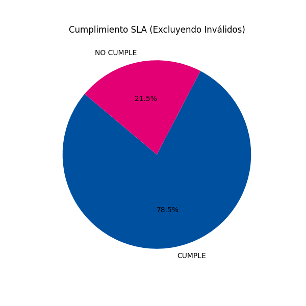
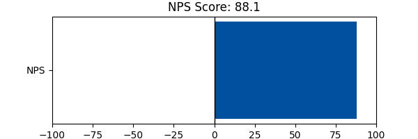

# Resumen Ejecutivo ADS 2025
## Análisis de Servicios y Cumplimiento SLA

**Transformación Empresarial**
*Fecha: Diciembre 2025*

---

# Agenda

1. Metodología
2. Cumplimiento SLA
3. Indicador NPS
4. Brokers Destacados
5. Recomendaciones

---

# 1. Metodología y Alcance

- **Fuente de Datos**: `Servicios brindados ADS 2025 (1).xlsx`
- **Volumen**: ~10,000 servicios analizados.
- **Proceso**:
  - Limpieza y normalización de fechas.
  - Cálculo automático de duración.
  - Aplicación de matriz de SLA por Tipo y Origen.

---

# 2. Cumplimiento de SLA Global

| Estado | Porcentaje |
| :--- | :--- |
| **CUMPLE** | **44.51%** |
| **INVALIDO** | 43.27% |
| **NO CUMPLE** | 12.22% |

> **Nota**: El alto porcentaje de inválidos se debe a tiempos no registrados en el sistema origen.

---

# 3. Indicador Net Promoter Score (NPS)

El **NPS** mide la lealtad de los usuarios basado en su probabilidad de recomendación.

## Score Actual: **88.08**

---

# 4. Top 5 Brokers por Volumen

Los siguientes clientes representan la mayor carga operativa:

1. **ASISTENCIA VIAL ASEGURADORA DEL SUR** (8366 servicios)
2. **ASISTENCIA VIAL- VEHICULOS GAMA ALTA** (1066 servicios)
3. **ASISTENCIA ASEGURADORA DEL SUR (ANTIGUO)** (431 servicios)
4. **ASISTENCIA VIAL PETROECUADOR** (234 servicios)

---

# 5. Recomendaciones Estratégicas

1. **Mejora en Captura de Datos**:
   - Auditar registros con fecha de asignación pero sin fecha de contacto.
   - Implementar validaciones en el CRM.

2. **Focalización Operativa**:
   - Revisar procesos con brokers que presentan cumplimiento < 80%.
   - Mantener el excelente nivel de satisfacción (NPS > 70 es clase mundial).

---

# ¡Gracias!

**Dudas o Comentarios**
Transformación Empresarial
